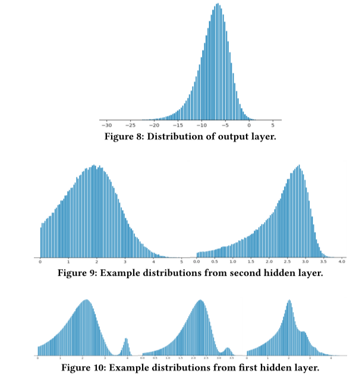

# Airbnb的两篇论文

## Applying Deep Learning To Airbnb Search（Airbnb,2019 KDD）

文章主要介绍了airbnb在搜索场景下由GBDT升级到DNN模型的过程，分别介绍了模型的迭代，包括了成功优化思路以及失败原因分析，特征工程以及系统工程三部分内容

### 模型迭代

#### 成功迭代

排序场景下的主要评价指标是 NDCG

- simple-NN (单隐层网络+ReLu+L2 regression Loss)
- Lambdarank NN (升级了pair-wise-loss 以及 用NDCG来加权pair-wise loss)
- Decision Tree/Factorization Machine NN (增加了fm以及gbdt的结果) 

- deep NN (2层隐层 [127,83], ReLu)

#### 失败迭代: 

- 加入房源id - 过拟合- id信息过于稀疏,房源一年最多出现365天 次数太少

- 多任务学习 不是很清晰

  

### 特征工程

特征工程的收获比较多,主要是要对特征的分布进行转换,

- 过去的特征工程:  在将特征输入模型之前推导出对特征执行的数学运算 
- 现在: 更多是对特征的分布进行调整,一个是要进行 标准化,避免异常值对nn模型的影响,一个是要使特征的**分布更加平滑** 

同时介绍了为什么要使得特征的分布平滑? 

- 容易发现bug  异常样本的特征分布往往与正常样本的分布是不同的  

- **促进泛化性**, dnn的输出层以及中间隐层的结果都是平滑的(其中隐层输出 经过了log变换), 同时这种平滑使得上层网络更容易处理新的特征,(来自下层的平滑分布确保上层可以正确地对不可见值的行为进行插值。)

  (因此也可以对embedding值直接进行平滑处理? bn? norm? 各种bn,ln操作)

  

- 通过检查特征的分布来检验是否缺少特征

### 系统工程

### 特征重要性

介绍了3种衡量特征重要性的方法

- 消融实验 - 减少某个特征查看指标下降程度,  

  - 问题是噪声? 

- 排列实验- 调整某个特征的取值, 所有可能取值中随机shuffle, 观察指标下降程度 ,

  - 问题是: 不同特征直接不是完全独立的,有一定的关联,即不能随意调整某个特征的值

- top-bottom 实验 - 观察排序top结果与bottom结果 与某个特征的分布,即看top结果和bottom结果的分布是否因为该特征有差异

  

## Improving Deep Learning for Airbnb Search (Airbnb,2020 KDD)

